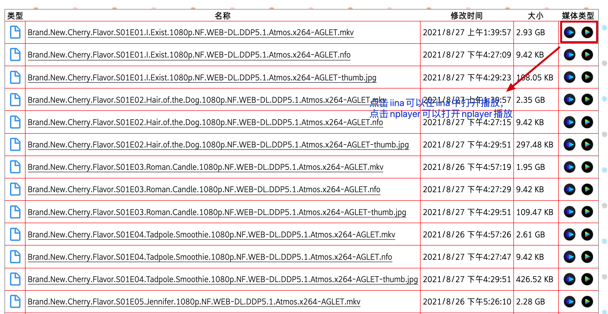
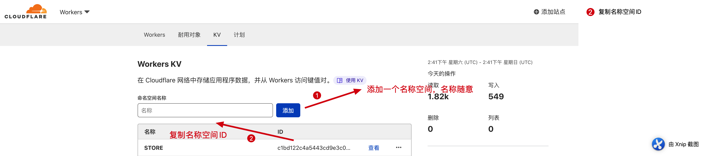

# drive-worker
Making your drive as online file website
# Experience
## Feature
1. tiny file use cloudflare proxy
2. url中可以设置是否由cloudflare代理
3. 支持直接调用iina和nplayer播放
4. 支持webdav，可以在视频播放中挂载，不建议挂载为文件系统，请求次数太过频繁会被微软临时限制请求
5. 无需服务器，0搭建维护成本
6. 支持简单安全认证

## Screenshot




# Start

## PreRequirement

1. one domain
2. one OneDrive account

## Deploy

### Register and bind domain to Cloudflare
You can reference many online tutorials. It is very simple.

### Copy account ID and zone ID


paster your **Account ID** and **Zone ID** to `wrangler.toml`

example:
```
account_id = "c04380e1591f31dd7c42f710541dd5d7"
zone_id = "ec1677e19b1b70e68d591fa5b8c5aa58"
```
**Account ID** replace`account_id`，**Zone ID** replace `zone_id`

### Cloudflare configuration
1. Add a namespace to Workers KV

名字可以随意填，copy **Namespace ID**，paste to `wrangler.toml`
```
{ binding = "STORE", id = "c1bd122c4a5443cd9e3c0321661a3293", preview_id = "c1bd122c4a5443cd9e3c0321661a3293" },
```
replace `id`和`preview_id`，two id keep same，do not change `binding`，which value is always *STORE*(no relationship with your namespace)


```
routes = [
   "your_domain/*",
   "drive.example.com/*"
]
```
replace domain

2. Add OneDrive application info

在Azure上面注册一个app，网址`https://aka.ms/appregistrations`


- 复制`Application (client) ID`
- 新建一个`client secret`，复制值
- 添加一个重定向的url，格式为`https://your_domain/fn/call`，`your_domain`就是你希望使用的域名


编辑创建的名称空间，新建一个名为`config`的条目，里面的内容这样填
```json
{
    "client":"your_client_id",
    "secret":"your_secret",
    "scope":["files.readwrite","offline_access"],
    "redirect":"https://your_domain/fn/call"
}
```

- `your_domain`就是你希望使用的域名，像`drive.example.com`之类的，最后就是`https://drive.example.com/fn/call`这样的形式
- `your_client_id`是新建的OneDrive应用的id

3. 安装cloudflare部署工具*wrangler*
具体如何安装，参考[wrangler](https://github.com/cloudflare/wrangler)，如果机器里面有安装`node`，执行下面这条命令`npm i @cloudflare/wrangler -g
`即可

然后通过`wrangler login`或者`wrangler config`登陆cloudflare账户

4. 修改管理员账号密码
在源码`src/const.ts`里面
```ts
export const TOKEN = {
    KEY: "token",
    VALUE: "EFF5D005-2E6A-4F3A-87B8-FF3D237AA902",
    USERNAME: "admin",
    PASSWORD: "123abc"
}
```
修改`USERNAME`、`PASSWORD`和`VALUE`，其中`USERNAME`是用户名，`PASSWORD`是密码，`VALUE`随便填，这里的用户名和密码是之后程序部署能够浏览目录的用户的信息

5. 部署
在`wrangler.toml`目录下面执行`wrangler publish`

6. Cloudflare添加DNS记录
添加一条上面你域名的dns记录，类型为`CNAME`，值可以随便填，必须勾选代理


7. 添加定时器
打开cloudflare里面的worker，找到`drive`这个worker，添加一个触发器，用来定时刷新OneDrive授权


最后打开`https://your_domain/fn/conf`登录你的onedrive账号，登录成功后，程序会自动查找云盘的`index.html`文件，如果有就会显示，没有就会显示错误的数据，一般用户没有目录浏览的权限，你可以通过`https://your_domain/fn/login`用上面配置的账号登录，这样程序就会显示目录，不会再查找`index.html`文件


# Common Issues
1. 为什么管理员用户名和密码写死在源码中，而不是保存在KV中，可以添加多个用户
这一点是基于性能考虑，cloudflare提供的worker访问kv的速度到底咋样，其实感受也不直观，理论上是没法避免访问kv的，毕竟onedrive的token是保存在kv中的

2. 为什么不提供网页播放，而是提供外部播放器打开
其实是有写网页播放的，地址是`/fn/play`，不过比较遗憾的是浏览器目前没办法硬解`HEVC`，同时html对mkv支持也不好，所以

# Credit

待补充。。。